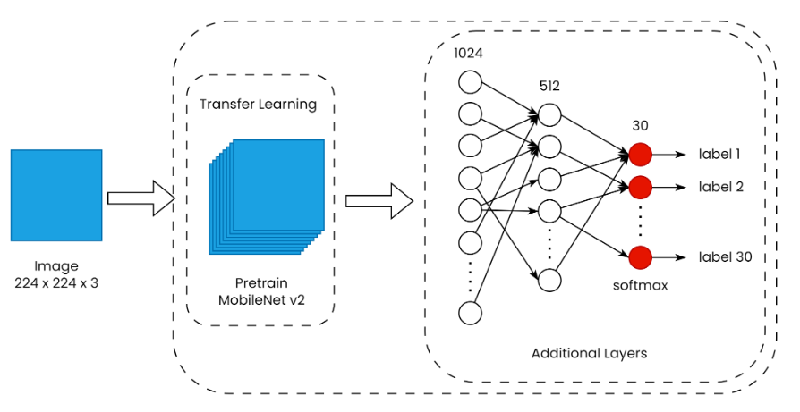
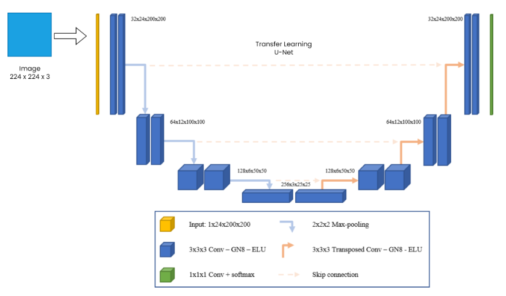

# Breeze Machine Learning v1

This repository contains an API for detecting food names and its carbon footprint from images using machine learning models.

## Overview

This API serves as a tool to identify various food items depicted in images. The machine learning models integrated into the API are trained on a diverse dataset of food images and can accurately predict the names of different types of cuisine based on the input image. The output also integrated with carbon footprint data for each ingredients.

## Folder Structure

- `/.github/workflows`: Contains docker instruction for deploying this repository
- `/app`: Includes the API code for handling image uploads and making predictions.
- `/app/model`: Contains fine-tuned models used for food name detection and food items segmentation

## Dataset
The dataset used for fine-tuning the models is [Breeze Food-Dataset](https://github.com/bangkit-breeze/breeze-datasets). The data contains 32 food categories with around 200 images per category. The dataset is collected by scraping google images and manually filtered by the team.

## API Documentation
The following endpoints are provided in this application:  
| Method | Endpoint                     | Description                                        |
| ------ | ---------------------------- | -------------------------------------------------- |
| GET    | /                            | Returns a welcome message                          |
| POST   | /predict                     | Returns the predicted food name, ingredients and its carbon footprint based on the input image |

### POST /predict
This endpoint accepts an image file and returns the predicted food name, ingredients and its carbon footprint based on the input image. The image file should be sent as part of a form data request. The response is a JSON object with the following format:
```json
{
  "name": "BREEZE Food Recognition",
  "version": "v1.0.1",
  "filename": string,
  "food_name": string,
  "confidence": string,
  "ingredients": [
    {
      "bahan": string,
      "berat": float,
      "carbon_footprint": float
    }
  ],
  "total_emissions": float
}
```


## Setup and Installation
To run the app locally, you need to have Python 3 installed on your machine with pip. You can install all required packages by running the command below in your terminal:
1. Clone this repository
2. Go to app folder
```bash
cd app
```
3. Create virtual environment
```bash
python -m venv env
```
4. Activate virtual environment
```bash
./env/Scripts/activate
```
5. Install all dependency packages
```bash
pip install -r requirements.txt
```
6. Run app locally
After installing all packages, you can run the app using the command below:
```bash
uvicorn main:app --reload
```
The app should be running at `http://127.0.0.1:8000`

## Deployment
This repository is deployed using Docker

## Architecture of The Models
### Food Name Detection Model

### Food Items Segmentation Model



## References
- Sandler, M., Howard, A., Zhu, M., Zhmoginov, A., & Chen, L. C. (2018). Mobilenetv2: Inverted residuals and linear bottlenecks. In Proceedings of the IEEE conference on computer vision and pattern recognition (pp. 4510-4520). [Read this paper](https://openaccess.thecvf.com/content_cvpr_2018/html/Sandler_MobileNetV2_Inverted_Residuals_CVPR_2018_paper.html)
- [FastAPI](https://fastapi.tiangolo.com/)

## Collaborator
Create with ❤️ by Breeze Machine Learning Team
- Hafidz Nur Rahman Ghozali
- Gilang Banyu Biru Erassunu
- Muhammad Daffa Ramadhan